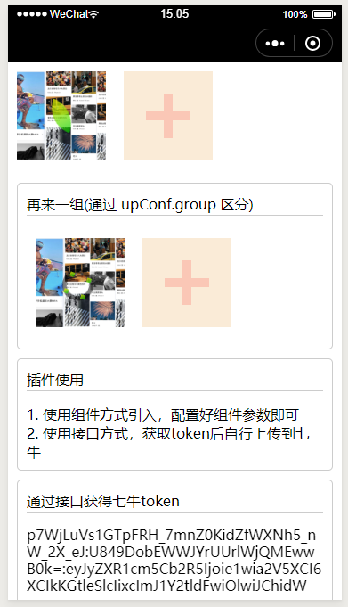

# vktool
使用小程序云函数，为开发者提供更多便捷能力；  
### 这个插件主要功能是啥？
    实现七牛云上传，你不用关心 token 策略，直接使用 ak、sk；
    你不用关心大图片（超过20m）的问题，已帮你做了瘦身处理，链接后增加.lim.jpg
    todo:
        分片上传(目前插件没有 FileSystemManager 权限，插件无法读取内容)
        编辑器上已跑通分片上传给七牛，可以参考  plugin/components/qiniu/upload.js 中 uploadFileBlock 函数
### 为什么做这样一个插件？
    1. 上传到七牛都需依赖服务端生成 token，为了省去这些重复的劳动；
    2. 七牛与小程序间的交互独立完成，由前端开发把控；
        上传可以走七牛的 https，下载原图走你绑定七牛的域名（可以使用七牛免费的 https，具体绑定看下面的交互逻辑）
        平常的图片显示就使用 http://你绑定在七牛的域名/图片.lim.jpg 减少流量指出
        图片.lim.jpg 就是普通图片，可以根据显示业务，增加图片处理参数（缩放、裁剪之类的）
        将七牛赠送的流量做最大化使用
        
 
代码地址 https://github.com/myzingy/wx-plugin-oxoo.git    
一些交互逻辑 https://www.processon.com/view/link/5d131b73e4b043f329a550a2  
你也可以将此插件部署在你的小程序插件里，为大家提供便捷  

##使用文档  
https://github.com/myzingy/wx-plugin-oxoo/blob/master/doc/README.md  
插件市场 https://mp.weixin.qq.com/wxopen/pluginbasicprofile?action=intro&appid=wxd3dc4206c76f14fc  

